# Project management using GitHub

**Author:** Bo Zhao ([zhaobo@uw.edu](mailto:zhaobo@uw.edu)) &nbsp;|&nbsp; **Points Available:** 50

In this lab, we will set up the project environment, synchronize course materials, and walk through the major operations for managing projects on GitHub. You will install the required software on your own PC or Mac, register a GitHub account, and learn to use Git, Visual Studio Code, and GitHub. As a capstone, you will create a GitHub repository to publish your resume page on the web. Let's get started!

## Learning objectives

By the end of this lab, you will be able to:

- Install and configure Git, Chrome, and Visual Studio Code for web development
- Clone a GitHub repository to your local machine and keep it in sync with `git pull`
- Author a Markdown document using standard syntax (headers, lists, links, images, blockquotes)
- Stage, commit, and push changes to a GitHub repository using either the terminal or VS Code
- Publish a static website from a GitHub repository using GitHub Pages

## Prerequisites

- A personal computer running Windows, macOS, or Linux
- Administrator access to install software
- A stable internet connection

## 1. Preparations

### 1.1 Environment setup
For this practical exercise, you will use chrome, git and visual studio code.

**Chrome:** is a freeware web browser developed by Google that runs on Windows, macOS, Linux, iOS, and Android. See the [Chrome installation demo](install-chrome.md).

**Git:** is a version control system (VCS) for tracking changes in files and coordinating work among multiple people ([download Git](https://git-scm.com/downloads)). It was created by **Linus Torvalds** in 2005 for Linux kernel development, and has since become the industry standard for source-code management. See the [Git installation demo](install-git.md). **Note: if you are using macOS, you do not need to install Git separately — it ships with the Xcode Command Line Tools.**

If **Git** is successfully installed, type `git` in command prompt (if you are a Windows user) or terminal (if you are a Mac or Linux user), the following screen will be shown up. Using `git`, you can synchronize the course materials and also publish your own GitHub repository.  We will talk about that later in this lab.

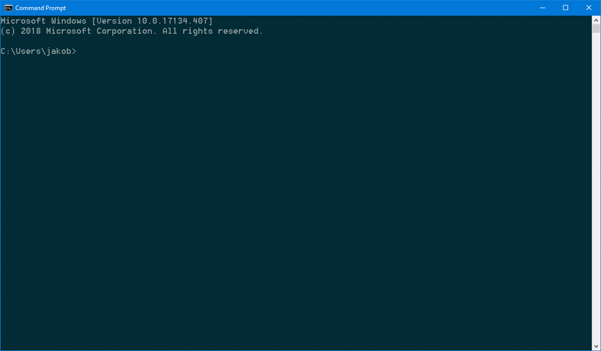

**Visual Studio Code:** is a streamlined code editor with built-in support for debugging, task running, and version control. It fills the gap between a plain text editor and a full IDE such as [Visual Studio IDE](https://visualstudio.microsoft.com/). [Download Visual Studio Code](https://code.visualstudio.com/). If you plan to work on a lab computer, see the [VS Code Portable Mode guide](https://code.visualstudio.com/docs/editor/portable).

> **What is an IDE?** An IDE (Integrated Development Environment) is a software application that bundles the tools a developer needs — source code editor, build tools, debugger, and often version control integration and code completion — into a single interface.

Visual Studio Code is a customizable IDE, so to fully prepare it for web programming, you will need to install additional packages. To do that, press `ctrl+shift+x`, or click on the "Extensions" button on the left tool bar. In this interface, please search and install the following recommended packages:

- Markdown Preview Enhanced
- Live Server

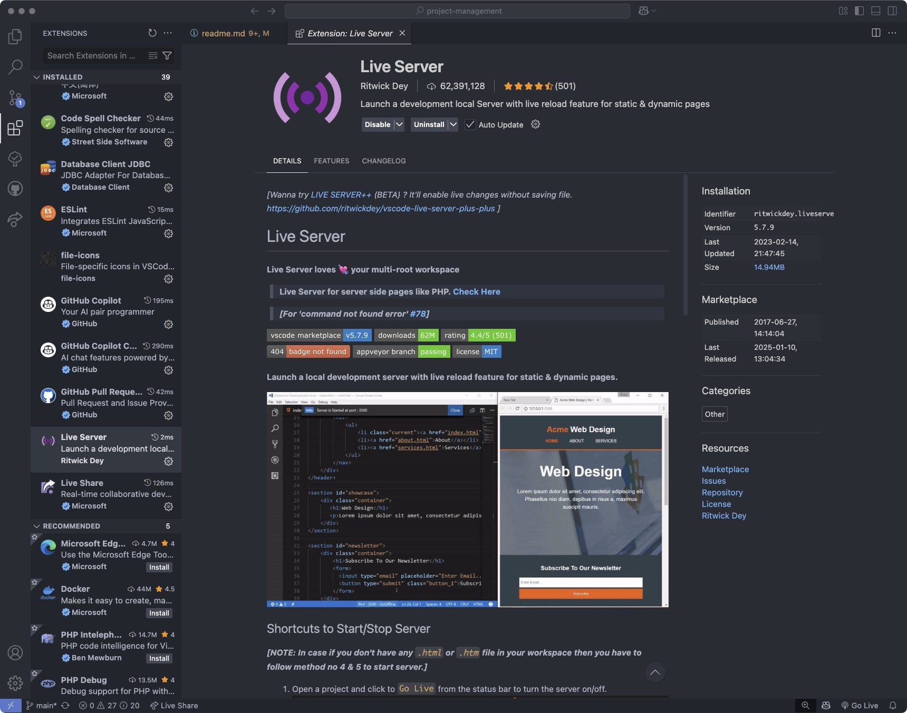

### 1.2 GitHub registration

A GitHub account is needed for managing and synchronizing your cloud based project. If you do not have a GitHub account yet, please sign up at [https://www.github.com](https://www.github.com). Notably, you will need to choose a username. It is worth noting that, **this username will be used as a part of the domain name of your home github ['username'.github.io](). So, make sure this username is succinct, simple and English-character only. Apparently, an easily-recognized domain name is more popular.**

**What is the difference between Git and GitHub?**

**Git** is the version control system itself — it runs locally on your computer and tracks changes to files.

**GitHub** is a web-based hosting service built around Git. It adds a browser UI, access control, issue tracking, pull requests, and collaboration features on top of Git. GitHub is today the world's largest host of source code, with over 100 million developers using the platform.

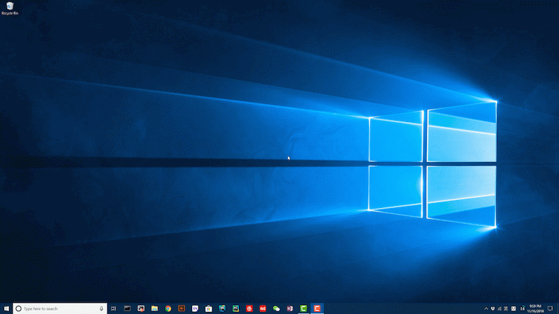

> A step-by-step tutorial on GitHub registration

## 2\. Download the course material

I host all course material on GitHub rather than Canvas. The goal is not to steepen the learning curve — it's to save you time downloading and updating course materials, and to expose you to an industry-standard workflow. Many companies in the geospatial industry already use GitHub for project management, including [ESRI](https://github.com/Esri), [CartoDB](https://github.com/CartoDB), and [Mapbox](https://github.com/mapbox). Let's walk through the procedure for downloading the lab material.

1\. On GitHub, each project is stored as a project repository. The repository for this Lab is located at [https://github.com/jakobzhao/project-management](https://github.com/jakobzhao/project-management). Please navigate to this url on a browser such as `Chrome`. As indicated by the course website url, this repository is created by me; my GitHub account name is `jakobzhao`, while the repository name is `project-management`.

2\. On the front page of this repository, click the green **`Code`** button. You can click `Download ZIP` to download a compressed copy of the course material.

3\. However, **we recommend you clone this project repository instead**. In the same dropdown, copy the **HTTPS URL** — it should be [https://github.com/jakobzhao/project-management.git](https://github.com/jakobzhao/project-management.git).

4\. Next, open your working space on your local computer through command prompt if you are on Windows or through terminal if you are on a Mac. Here, the working space is just a centralized folder on your local computer where you can store your working materials. For me, I created a working folder to locally store my github repositories. For example, the working space of my computer is located as `C:\Workspace`. But it is up to you under which folder or path to put the workspace folder.

```powershell
C:\Users\[windows_or_macosx_username]>cd C:\Workspace
C:\Workspace>
```

5\. Once acquiring the **git url** -  https://github.com/jakobzhao/project-management.git, we use the command `git clone` to clone the GitHub repository to your local computer.

 ```powershell
C:\Workspace\>git clone https://github.com/jakobzhao/project-management.git
Cloning into 'project-management'...
remote: Counting objects: 962, done.
remote: Compressing objects: 100% (750/750), done.
remote: Total 962 (delta 214), reused 917 (delta 177), pack-reused 0Receiving objects:  99% (953/962), 158.77 MiB | 1.60 MiB/s
Receiving objects: 100% (962/962), 158.88 MiB | 1.60 MiB/s, done.
Resolving deltas: 100% (214/214), done.
Checking out files: 100% (650/650), done.
 ```

6\. To review the files and folders in the downloaded/cloned repository, you need to `cd` into the root directory of this repository. If you are on a Mac or Linux, type `ls` to check the file list of this repository, or try `dir` if you are on a Windows. Take windows for example.

```powershell
C:\Workspace>cd project-management

C:\Workspace\project-management>dir
Volume in drive C has no label.

Directory of C:\Workspace\project-management

04/23/2026  09:24 AM    <DIR>          .
04/23/2026  09:24 AM    <DIR>          ..
04/17/2026  09:24 AM    <DIR>          img
02/15/2026  09:24 AM                28 install-chrome.md
02/15/2026  09:24 AM                25 install-git.md
04/23/2026  09:24 AM            25,097 readme.md
02/15/2026  09:24 AM               127 repo-git.md
               4 File(s)         25,277 bytes
               1 Dir(s)
```

Or, on macOS/Linux:

```bash
$ cd project-management
$ ls
img  install-chrome.md  install-git.md  readme.md  repo-git.md
```

In the root directory of `project-management`, you'll find an `img/` folder (lab screenshots and GIFs), `readme.md` (this document), and a few supporting installation guides.

7\. Next, we open the `readme.md` file using `Visual Studio Code`. To do that, make sure you have installed the program `Visual Studio Code` and the recommended packages, such as `Markdown Preview Enhanced`.

Once `Visual Studio Code` is opened, press `ctrl+k` and then `ctrl+o` to open the open folder window, navigate to `project-management` folder from your workspace and press `select folder`. Then the `project-management` repo will be opened, and a file tree will be shown in the project list panel on the left of the vscode window.

**Note:** Your folder name should be project-management. The below screenshot is only to give you an idea of what window you will see.

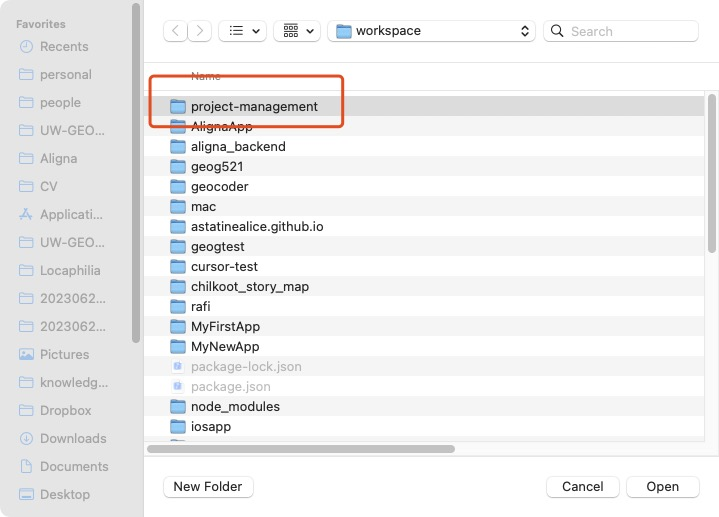

In the project list panel, navigate to the `README.md` in the project tree panel. Double-click on the `README.md` file, you will see the source code. Then, right-click this file and then click on `Open Preview`, The rendered page of `README.md` will be shown in a new panel. If you want to view the source code and the rendered markdown at the same time, press `ctrl+\` (or click on the `Split Editor Right` button at the upper right corner of the vscode window), and then drag the "Previewed README.md" window to the new panel on the right.

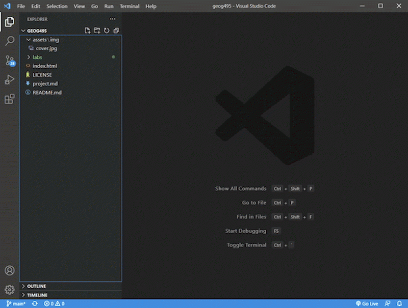

8\. To synchronize the course material from GitHub to your local computer, run `git pull` from the root directory of the repository. The output will look like this:

```powershell
C:\Workspace\project-management>git pull
remote: Counting objects: 3, done.
remote: Compressing objects: 100% (3/3), done.
remote: Total 3 (delta 2), reused 0 (delta 0), pack-reused 0
Unpacking objects: 100% (3/3), done.
From https://github.com/jakobzhao/project-management
   13b2cab..baf74b1  main     -> origin/main
Updating 13b2cab..baf74b1
Fast-forward
 readme.md | 3 ++-
```

Your local copy of the course material is now up to date.

> **Do not** run `git` with `sudo` on macOS/Linux — it rewrites file ownership and will cause permission errors on future pulls. If you hit a permission error, fix the folder ownership instead. Similarly, **do not** use `git checkout --force` as a sync shortcut: it silently discards any local changes you've made.

**Note:** To ensure you have the latest version of the lecture or lab handouts, **synchronize regularly — especially before each class** — by running `git pull` again.

9\. Before we jump to the next section, please:

- Star the course repository [https://github.com/jakobzhao/project-management](https://github.com/jakobzhao/project-management) by pressing the `star` button on the top right, and;

- Navigate to Dr. Zhao's front page at [https://github.com/jakobzhao](https://github.com/jakobzhao), and click the `Follow` button to be a follower.

## 3\. Project management

In this section, we will introduce a series of operations related to project management, such as create a project repository, compile a markdown file, and upload files to GitHub, and at last, publish a repository. As a practice, we will build a GitHub repository for your online resume.

### 3.1 Create a repository for your project

1\. Navigate to [https://github.com/new](https://github.com/new), and input your repository name in the blank text box of the `Repository name`. Here, please name your repository in the format of **[github_username].github.io**. For example, if your github_username is `geovizlabtest`, the repository name will be **geovizlabtest.github.io**.

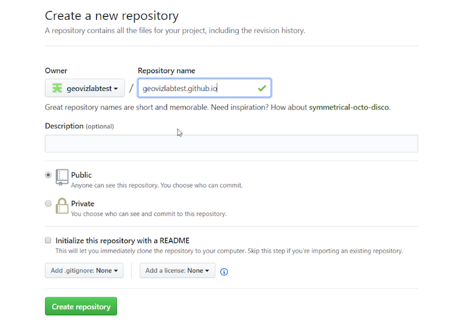

2\. Besides, make sure you **check** the box `Initialize this repository with a README`. You can leave other options by default.

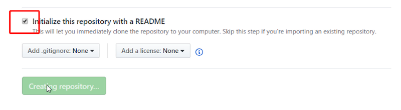

3\. Next, click the `Create repository` button. As a result, a new repository `[github_username].github.io` is created. You can access this repository through the link `https://github.com/[github_username]/[github_username].github.io`. For example,  you can access the repository geovizlabtest.github.io through the link [https://github.com/geovizlabtest/geovizlabtest.github.io](https://github.com/geovizlabtest/geovizlabtest.github.io).

### 3.2 Compose a Markdown file

1\. On your local computer, create a text file, and name it `resume.md`.

2\. Open this file `resume.md` with `Visual Studio Code`. Then, you can work on your resume. If you are not familiar with Markdown, please refer to a tutorial at [here](https://guides.github.com/features/mastering-markdown/). Or you can start with copying and pasting the template below. Notably, this template is only for your reference. You probably do not want to share too much about your personal information such as phone number, address and etc. You can also provide made-up information if you feel uncomfortable sharing your personal information online. This is just a practice for your to get familiar with markdown.

```markdown
# Your Name

your.name@example.com

http://www.example.com

http://www.linkedin.com/in/yourname

# Summary

Quick Summary (not objective) specifically highlighting why you qualify for the job.

# Work Experience (only last 10 years)

## University Name 1 (City, State)

* [University 1][] description, particularly if not well-known.*

** Position Title (include alternate titles in parentheses)** (Start Date - End Date)

Summary of your role

- Accomplishment that contains **bold text**.
- Accomplishment
- Accomplishment
- Accomplishment

## University Name 2 (City, State)
*[University 2][] description, particularly if not well-known.*

** Position Title (include alternate titles in parentheses)** (Start Date - End Date)

Summary of your role

- Accomplishment that contains **bold text**.
- Accomplishment
- Accomplishment
- Accomplishment

## University Name 3 (City, State)
* [University 3][] description, particularly if not well-known.*

** Position Title (include alternate titles in parentheses)** (Start Date - End Date)

Summary of your role

- Accomplishment
- Accomplishment
- Accomplishment
- Accomplishment


[University 1]: http://www.univ1.edu
[University 2]: http://www.univ2.edu
[University 3]: http://www.univ3.edu
```
**Note:** This resume template is from [http://www.jasonfilley.com/resumeinmarkdown.html](http://www.jasonfilley.com/resumeinmarkdown.html).


3\. In fact, you can use any text editor to generate Markdown files. If you do not have `Visual Studio Code` at hand, you can use `Notepad` on Windows or `TextEdit` on MacOS as well.  Please let the instructor know if you meet any difficulty in installing this plugin.

### 3.3 Upload files to GitHub

Once you have drafted out your resume page in the `resume.md` file. You will upload this file to the **root** of the project repository `https://github.com/[github_username]/[github_username].github.io` . In general, there are three options to complete this task, we will introduce them one by one.

#### 3.3.1 Drag & drop

1\. Open a web browser such as `Chrome`, navigate to the front page of the repository you have just created.

2\. Next, use your mouse to drag the `resume.md` file to the front page. Once you see a notice saying **Drop to upload your files**, you can then release your mouse. A new interface will appear as below.

**Note:** Certainly, you can drag and drop multiple files and/or folders. In this lab, we just upload one single file.

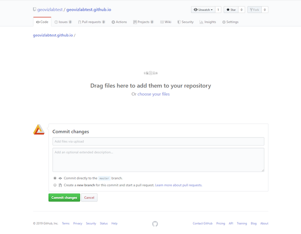

3\. Before pressing the green button `Commit Changes`, you might want to add a title and/or some descriptions for this commit. It will help you organize your commits.

#### 3.3.2 Git push

You can also upload `resume.md` via the `git push` command from a terminal or command prompt.

1\. **Authenticate first.** GitHub stopped accepting account passwords for Git operations in August 2021. The easiest modern option is to install the [GitHub CLI](https://cli.github.com/) and run `gh auth login` once — it handles the token exchange for you. If you prefer to do it manually, follow the [personal access token guide](https://docs.github.com/en/authentication/keeping-your-account-and-data-secure/managing-your-personal-access-tokens) and paste the token when Git prompts for a password.

2\. Clone your `[github_username].github.io` repository to your workspace, following the instructions in Section 2.

3\. Copy your edited `resume.md` into the root of that local repository.

4\. From the repository root, stage, commit, and push your changes:

```powershell
c:\Workspace\[github_username].github.io>git add resume.md
c:\Workspace\[github_username].github.io>git commit -m "add resume"
c:\Workspace\[github_username].github.io>git push
```

**Note:** 

1. If this is your first time using Git, you will be prompted to set your identity before you can commit. Run these two commands once:

   ```
   git config --global user.email "you@example.com"
   git config --global user.name "Your Name"
   ```

    The `--global` flag applies the setting to every repository on your machine. Drop it if you only want to set it for the current repository.

2. Never run Git with `sudo` on macOS or Linux — it will change file ownership and break future pulls. If you hit a "permission denied" error, fix the directory ownership with `chown` instead.


In a nutshell, to push a change from your local computer to GitHub, you (1) `git clone` the repository, (2) `git add` your new or modified files, (3) `git commit` with a message describing the change, and (4) `git push` to upload the commit.

#### 3.3.3 Visual Studio Code based commit and push

We can also use `Visual Studio Code` to upload files to GitHub repository or more generally, commit changes. Compared with the first two solutions, I recommend you use vscode if you prefer graphic user interfaces.

1\. Download the repository  `https://github.com/[github_username]/[github_username].github.io`  following the instruction in Section 2 *"Download the course material"*. Note here you need to **download the repo you created** earlier, not the class repository

2\. In the root directory of the downloaded repository, please copy the edited `resume.md` to the root.

3\. Open Visual Studio Code, and open the downloaded repository folder following the instruction in Section 2 *"Download the course material"*.

4\. Once you open this repository, you can edit the `resume.md` in Visual Studio Code. Remember to save (`ctrl+s`) your files after editing

5\. To update any edit changes, click on the "Source Control" button on the left toolbar. Then click on the "Stage All Changes" button (plus sign, be sure to click on the button  on the right side of "Changes"), input your commit message in the textbox above, click on the "Commit" button (check sign), and then click on the "Views and More Action..." button (three dots) and choose "Push".

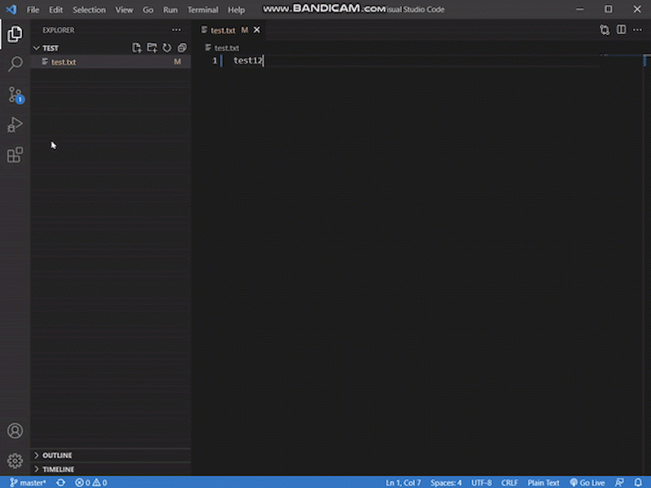

You may be prompted to enter your authentication information during the process, you can either choose to sign in with your browser or use the personal access token that we just acquired earlier.

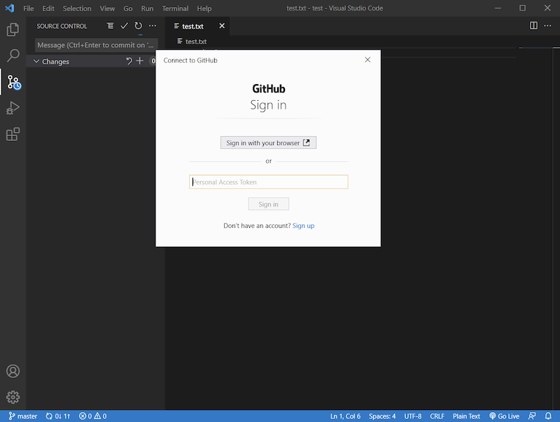

> **Note:** Approaches 2 and 3 have the same underlying logic — approach 2 runs in a terminal (command-line interface), while approach 3 runs in Visual Studio Code (graphical interface).
>
> Any of the three approaches (3.3.1–3.3.3) will upload your resume or any other files to GitHub. Check the repository page on GitHub to confirm the upload. Of the three, **approach 3.3.3 (VS Code) is recommended.**

Now you have already known how to commit a change. In practice, you will use this operation very frequently. Other than committing changes, you may also need to synchronize, both fetch and push, the latest version of your GitHub repository.

### 3.4 Publish your repository

Once `resume.md` is in the root of your GitHub repository, you can turn on **GitHub Pages** to render it as a web page. GitHub Pages runs your repo through Jekyll, which converts Markdown files to HTML — so `resume.md` becomes `https://[github_username].github.io/resume`.

> Note: GitHub can take from a few seconds up to a couple of minutes to build and publish the site. If the URL doesn't load right away, wait a moment and refresh, or try another browser.

1\. Click the **Settings** tab on the repository page.

2\. In the left sidebar, open **Pages**. Under **Build and deployment → Source**, choose **Deploy from a branch**, then under **Branch** pick `main` and `/ (root)`, and click **Save**.

3\. GitHub will build the site. Once the build finishes (usually under a minute), your resume will be live at `https://[github_username].github.io/resume`.

**Note:** Similar to step 8 in Section 2, you can pull the latest remote changes into your local repository from Visual Studio Code. Click the sync/status indicator in the bottom status bar, or use the Source Control panel's **...** menu and choose **Pull**.

## 4. Website host using GitHub Pages

GitHub can serve a repository as a website. In this section, you will download a Bootstrap website template, modify it to your taste, and upload it to the `[github_username].github.io` repository you just created. Once you're done, the site will be live at `https://[github_username].github.io`.


[Start Bootstrap](https://startbootstrap.com/) hosts free Bootstrap-based templates. Bootstrap is an open-source CSS framework for responsive, mobile-first front-end development, with ready-made styles for typography, forms, buttons, navigation, and other UI components.

1\. Visit [https://startbootstrap.com/template/the-big-picture/](https://startbootstrap.com/template/the-big-picture/) and download the template.

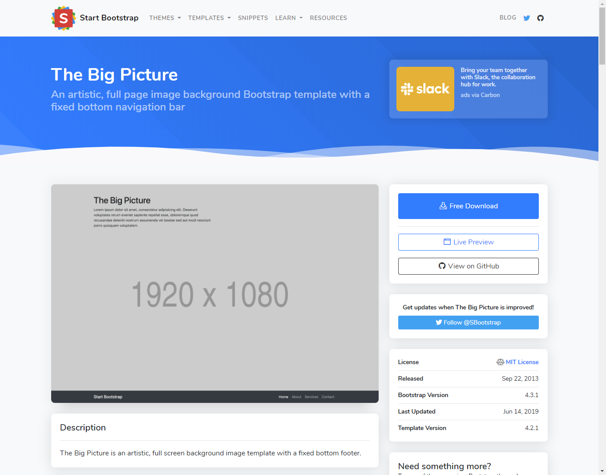

2\. Unzip the archive and move its contents into your local `[github_username].github.io` folder.

**Note:** If your OS doesn't unzip out of the box, install [7-Zip](https://www.7-zip.org/download.html) on Windows or [Keka](https://www.keka.io/en/) on macOS.

3\. Upload all extracted files (except the template's own `readme.md`, which would overwrite yours) to the root of `https://github.com/[github_username]/[github_username].github.io`. Use the VS Code sync workflow from **Section 3.3.3**.

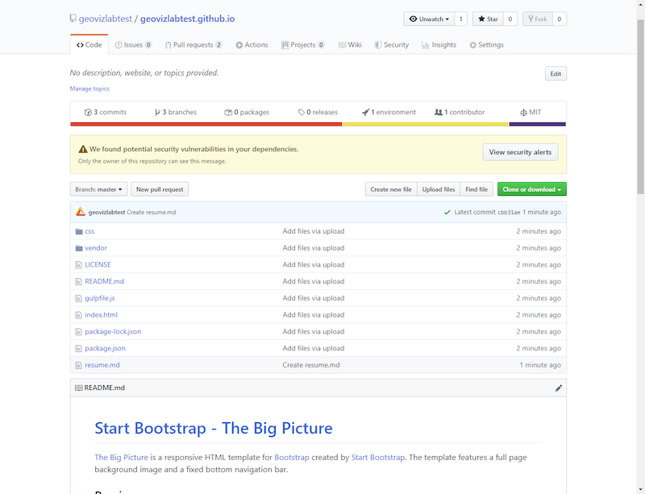

4\. After the push succeeds, visit `https://[github_username].github.io` in a browser. For example, `https://geovizlabtest.github.io`. The URL automatically serves the repository's default page, which is typically `index.html`.

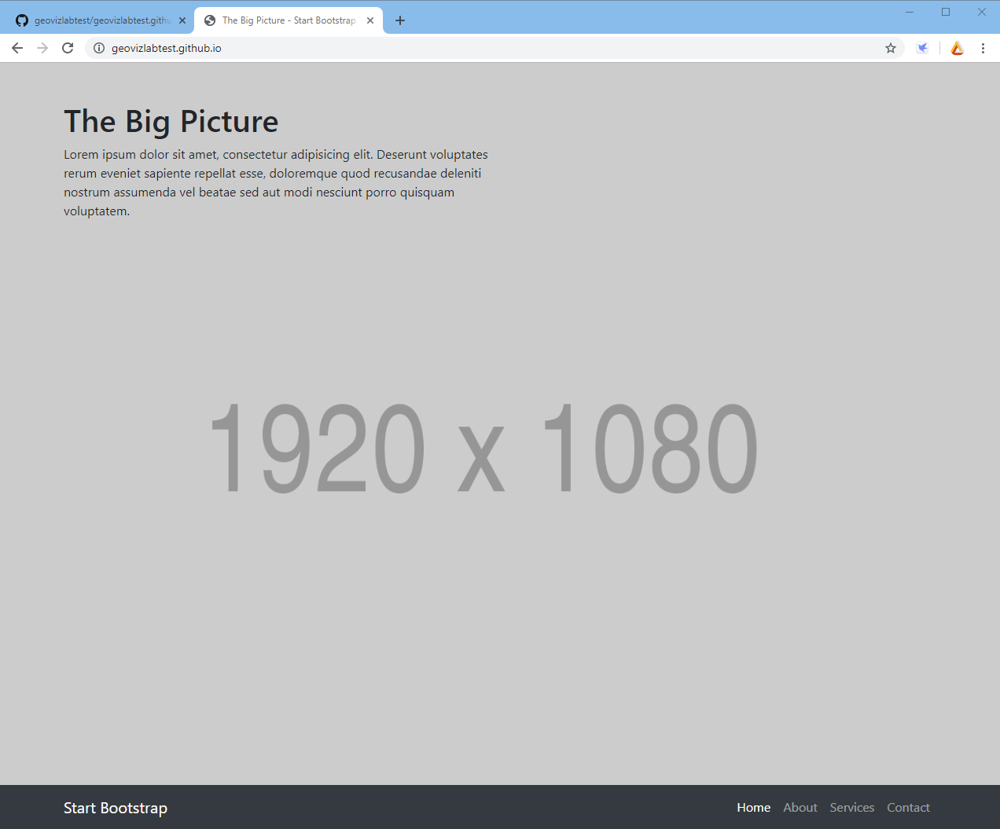

5\. Edit the template files in your local repository, push the changes, and refresh `https://[github_username].github.io` to see them go live. If you want to get more comfortable with web development, work through the [W3Schools tutorials](https://www.w3schools.com/), especially:

- [HTML](https://www.w3schools.com/html/default.asp)
- [JavaScript](https://www.w3schools.com/js/default.asp)
- [CSS](https://www.w3schools.com/css/default.asp)
- [Bootstrap 5](https://www.w3schools.com/bootstrap5/default.asp)


## 5. Deliverable

Before submitting, confirm that **GitHub Pages** is working. Submit the URL of your GitHub repository to the **Canvas Dropbox** for this course. The URL should be in the format `https://github.com/[github_username]/[github_username].github.io`. To submit, open the lab item on the Assignments tab and click **Submit Assignment**. Contact the instructor if you have any trouble submitting.

### Grading criteria (50 points)

1\. A GitHub account is registered. You have followed the instructor's GitHub account and starred the course repository. **(10 pts)**

2\. The repository is named `[github_username].github.io`. **(5 pts)**

3\. GitHub Pages is enabled, and your resume is reachable at `https://[github_username].github.io/resume`. **(5 pts)**

4\. To exercise Markdown syntax, your resume may be based on the template in Section 3.2, but feel free to customize it. The resume should include **(15 pts)**:

* Headers at multiple levels
* A blockquote
* Several hyperlinks
* One or more images
* A list

5\. Build a website in the same repository. It can be [an online resume](https://startbootstrap.com/themes/resume/), [a project gallery](https://startbootstrap.com/template/shop-homepage), [a project website](https://startbootstrap.com/themes/creative/), [an admin dashboard](https://startbootstrap.com/themes/sb-admin-2/), or anything else. Use any Bootstrap 5 template from [Start Bootstrap](https://startbootstrap.com/) and modify it as needed. A complex multi-page site is not required — just something that represents an idea you want to work on. **(15 pts)**

### Submission policy

- Lab assignments are submitted electronically to Canvas unless stated otherwise. Grading will typically be completed within one week.
- Assignments are due by the posted deadline. ***A late penalty of at least 10 percentage points per day will apply.***
- If you have a genuine reason for needing an extension (documented medical condition, deadlines piling up across other courses, ROTC, athletics, job interviews, religious obligations, etc.), some flexibility is possible — **but you must contact the instructor before the deadline.** Unannounced late submissions will still incur the late penalty. For truly unforeseeable problems, more flexibility is possible.
- If ongoing medical, personal, or other circumstances are likely to affect your work throughout the semester, please meet with the instructor to discuss accommodations.
- There will be **no make-up exams** except under the circumstances above.
